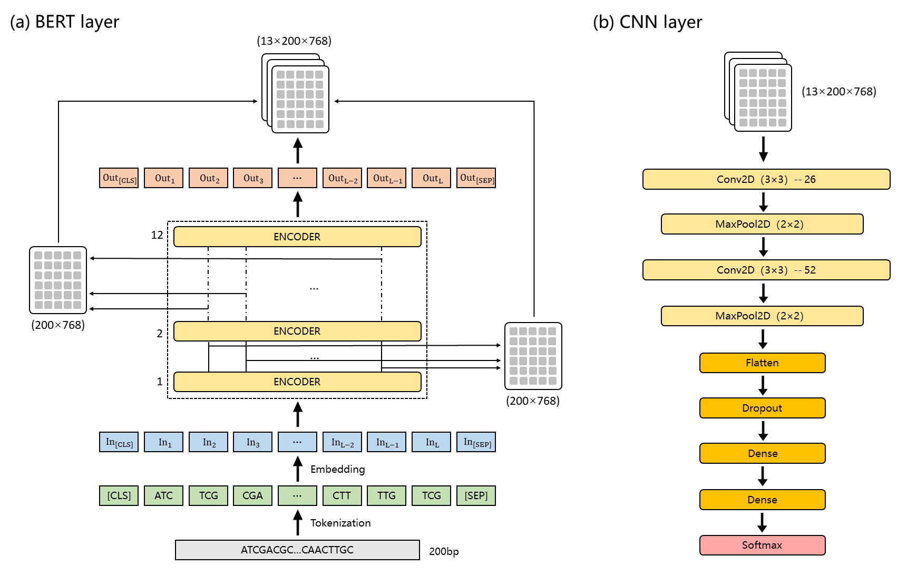

# iEnhancer-BERT
We propose iEnhancer-BERT, a novel transfer learning method based on pre-trained DNA language model using the whole human genome. More specifically, iEnhancer-BERT consists of a BERT layer for feature extrac-tion and a CNN layer for classification. We initialize our parameters of the BERT layer using a pre-trained DNA language model, and fine-tune it with transfer learning on the enhancer identification tasks. Unlike common fine-tuning strate-gies, we extract the output of all Transformer Encoder layers to form the feature vector. Experiments show that our method achieves state-of-the-art results in both enhancer identification tasks and strong enhancer identification tasks.

## 1. Environment setup

We recommend you to build a python virtual environment with [Anaconda](https://docs.anaconda.com/anaconda/install/linux/). We applied training on a single NVIDIA Tesla V100 with 32 GB graphic memory. If you use GPU with other specifications and memory sizes, consider adjusting your batch size accordingly.

#### 1.1 Create and activate a new virtual environment

```
conda create -n ienhancer-bert python=3.6
conda activate ienhancer-bert
```


#### 1.2 Install the package and other requirements

(Required)

```
conda install pytorch torchvision cudatoolkit=10.0 -c pytorch
git clone https://github.com/lhy0322/iEnhancer-BERT
cd iEnhancer-BERT
python3 -m pip install --editable .
cd examples
python3 -m pip install -r requirements.txt
```
## 2. Download pre-trained DNABERT
The [DNABERT](https://github.com/jerryji1993/DNABERT) provides four pre-trained models that have been trained on the whole human genome. Please go to their github and download the corresponding k-mer pre-training model. Then unzip the package by running:
```
unzip 3-new-12w-0.zip
unzip 4-new-12w-0.zip
unzip 5-new-12w-0.zip
unzip 6-new-12w-0.zip
```
## 3. Model pipeline
#### 3.1 Data processing
Use "data_precess_layer1.py" file to generate k-mer sequences files from FASTA file (enhancer identification task)

Use "data_precess_layer2.py" file to generate k-mer sequences files from FASTA file (strong enhancer identification task)

#### 3.2 Train
Use "run_train.py" or

```
export KMER=3
export MODEL_PATH=pretrain_model/3-new-12w-0
export DATA_PATH=data_process_template/data/layer1_3mer
export OUTPUT_PATH=result
export STEP=200

python run_enhancer.py \
    --model_type dna \
    --tokenizer_name=$MODEL_PATH/vocab.txt \
    --model_name_or_path $MODEL_PATH \
    --task_name dnaprom \
    --do_train \
    --do_eval \
    --data_dir $DATA_PATH \
    --max_seq_length 200 \
    --per_gpu_eval_batch_size=128   \
    --per_gpu_train_batch_size=32   \
    --learning_rate 4e-4 \
    --num_train_epochs 5.0 \
    --max_steps $STEP \
    --output_dir $OUTPUT_PATH \
    --evaluate_during_training \
    --logging_steps 100 \
    --save_steps 100 \
    --early_stop  5    \ 
    --hidden_dropout_prob 0.1 \
    --overwrite_output \
    --weight_decay 0.01 \
    --n_process 8
```
#### 3.2 Test
Use "run_predict.py" or

```
export KMER=3
export MODEL_PATH=result
export DATA_PATH=data_process_template/data/layer1_3mer
export PREDICTION_PATH=predict/layer1

python run_enhancer.py \
    --model_type dna \
    --tokenizer_name=$MODEL_PATH/vocab.txt \
    --model_name_or_path $MODEL_PATH \
    --task_name dnaprom \
    --do_predict \
    --data_dir $DATA_PATH  \
    --max_seq_length 200 \
    --per_gpu_pred_batch_size=128   \
    --output_dir $MODEL_PATH \
    --predict_dir $PREDICTION_PATH \
    --n_process 12
```
